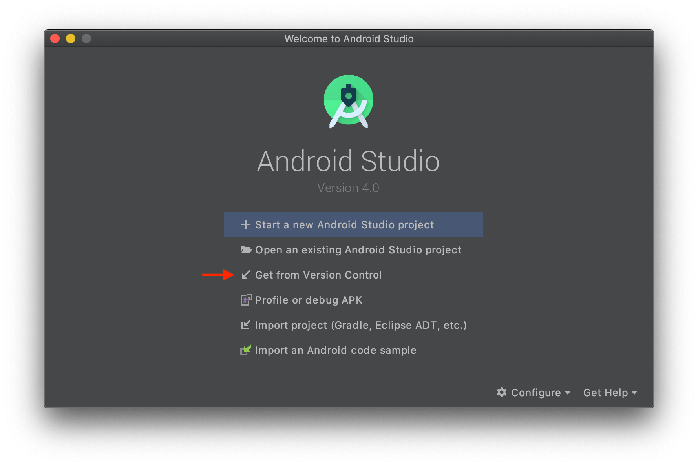
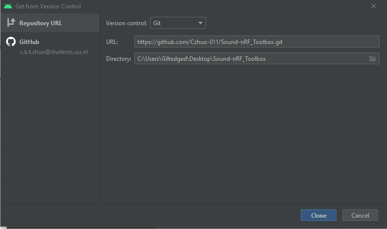

# Sound nRF Toolbox
 
Sound nRF is an extended version of the nRF Toolbox which can be found at https://github.com/NordicSemiconductor/Android-nRF-Toolbox. it connects to a BLE (Bluetooth low energy) device and provide audio feedback in sync with the provided cadence characteristic measurement. The sound feedback enables for 2-minutes. At the end of the 2-minutes, the present cadence serves as the predefined threshold. As long the present cadence stabilizes within 15 range, the sound gets disabled after the initial 2-minute. If it deviates from the present cadence by 15, the sound re-enables for another 2-minutes. With this system, runners do not receive constant feedback when their cadence stabilizes. The sound serves as an auditory alarm and a compass to help runners find their ideal cadence.

## Requirements.
- An Android IDE for Android operating system such as Android Studio (https://developer.android.com/studio)
- An Android Mobile Smartphone. Sound nRF Toolbox is currently compatible to android devices. For assurance, android 10 update is ideal. Android 4.3 or newer is required.
- A Sensor device with BLE supported that provides RSC (Running speed and cadence) data. e.g. Stryd

## Cloning the repository with version control
With Android Studio, you don't need to use the terminal to contribute to an Android project on GitHub. It has native integration with git and GitHub to allow most actions via the Android Studio UI.

When you open Android Studio, it offers the option to open a project from version control. That's the option we'll use.

After selecting that option, you can type the URL of the repository, press "Clone", and select a folder. After that, Android Studio will do all the work and open the project ready to go

  
   

## RSC path

To find the path to RSC cadence characteristics, go to <i>Users\username\...\Android-nRF-Toolbox-master\app\src\main\java\no\nordicsemi\android\nrftoolbox\rsc\ </i>

Find more information in the Manual.pdf
 

